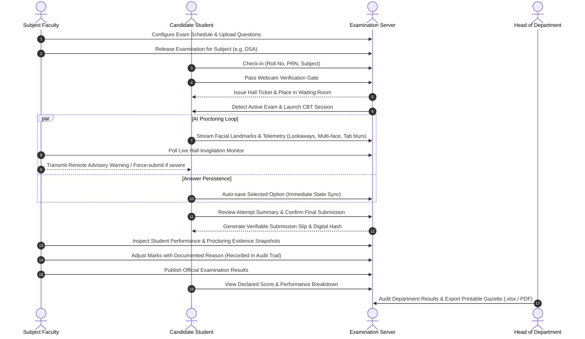

# GHRCEM Autonomous College Examination & Academic Administration Portal

[](https://ghrcem.raisoni.net)
[](#)
[](#)
[](#)
[](#)

An enterprise-grade, institutional Computer-Based Testing (CBT), AI Proctoring Surveillance, and Academic Evaluation system custom-tailored for autonomous engineering college curricula. Built for **G H Raisoni College of Engineering and Management (GHRCEM), Wagholi, Pune** (Affiliated to Savitribai Phule Pune University).

---

## 🏛️ System Overview

The GHRCEM Examination Portal unifies the entire examination lifecycle into a secure, multi-tier institutional workflow:

1. **Academic Administration & HOD Control**: Master exam release switchboard across academic departments, cross-division performance analytics, faculty directories, official gazette generation, and immutable audit logs.
2. **Faculty Subject In-Charge**: Subject-isolated question banking (LaTeX-compatible statements, diagrams, option weighting), live hall invigilation monitor, remote warning transmitters, proctoring evidence review, mark adjustments with audit reasons, and official result publication.
3. **Class Teacher Portal**: Division student roster management, one-click Excel (`.xlsx`) batch sync, candidate exam status monitoring, and division scorecards.
4. **Candidate Examination Environment**: Official hall ticket admittance pass, camera gatekeeper, real-time MediaPipe AI facial surveillance, tab-blur and full-screen enforcement, auto-saving answer engine, and verifiable submission acknowledgment receipts.
5. **Interactive 3D Campus Twin**: Real-time procedural Three.js architectural rendering of the GHRCEM Wagholi campus integrated directly into the institutional portal entryway.

---

## ⚙️ Technology Stack

| Layer | Technologies / Libraries |
|---|---|
| **Backend Runtime** | Node.js (v18+ LTS), Express.js (REST API & session handling) |
| **Security & Cryptography** | Node.js `crypto` (`scrypt` password hashing with unique salt, `timingSafeEqual`), Role-based access control, Cookie session tokens |
| **AI Proctoring Engine** | Google MediaPipe Vision (`@mediapipe/tasks-vision`, `FaceLandmarker`), WebRTC `getUserMedia`, Canvas real-time geometric landmark analysis |
| **Data & Persistence** | Isolated JSON document datastores (`questions_by_subject/`, `submissions.json`, `audit_logs.json`, `students.json`, `users.json`) |
| **Spreadsheet Processing** | SheetJS (`xlsx`) for batch student roster ingestion and one-click marks tabulation export |
| **3D Visualization** | Three.js (WebGL procedural campus twin with dynamic day/night cycles, shadows, and institutional architecture) |
| **Frontend Styling** | Academic ERP Design System: High-contrast typography, zero-distraction layout, accessible status tokens, responsive CSS Grid / Flexbox |

---

## 🔄 Examination & Proctoring Lifecycle



---

## 🚀 Quick Start & Installation

### Prerequisites
- [Node.js](https://nodejs.org/) v18.0.0 or higher
- Modern Chromium-based or Firefox browser with webcam access

### 1. Clone & Install Dependencies
```bash
git clone https://github.com/Princejha-2006/final-year-project-exam-portal.git
cd final-year-project-exam-portal
npm install
```

### 2. Configure Environment (Optional)
Copy the template configuration:
```bash
cp .env.example .env
```
Default parameters run on `http://localhost:3000`.

### 3. Run Test Suite
Verify security controls, staff authorization boundaries, subject isolation, and submission singletons:
```bash
npm test
```

### 4. Start Application
```bash
npm start
```
The portal will be live at:
- **Staff & Academic Administration:** `http://localhost:3000/staff` (or `http://localhost:3000`)
- **Candidate Student Portal:** `http://localhost:3000/student`

---

## 👥 Pre-Seeded Academic Demo Accounts

The portal comes pre-loaded with verified institutional test accounts for academic demonstration:

### Staff & Administration (`/staff`)
| Role | Staff ID | Password | Scope / Department |
|---|---|---|---|
| **Head of Department (HOD)** | `HOD001` | `admin` | Department of Computer Engineering & AI |
| **Subject Faculty** | `FAC001` | `faculty` | Data Structures & Algorithms (DSA) |
| **Subject Faculty (AI)** | `FACAI` | `faculty` | Artificial Intelligence (AI) |
| **Class Teacher (Div A)** | `CLASSAAIML` | `CLASSA2026` | SY-AIML Division A |
| **Class Teacher (Div B)** | `CLASSBAIML` | `CLASSB2026` | SY-AIML Division B |
| **Class Teacher (Div C)** | `CLASSCAIML` | `CLASSC2026` | SY-AIML Division C |

### Student Candidates (`/student`)
| Roll Number | Candidate Name | Division | Enrolled Subject |
|---|---|---|---|
| `23AIML001` | Aarav Sharma | Division A | DSA / AI |
| `23AIML004` | Sakshi Joshi | Division B | DSA / AI / DBMS |
| `23AIML005` | Aditya Kulkarni | Division B | DSA |
| `ROLL101` | Rahul Sharma | Division A | DSA |
| `ROLL102` | Sneha Gupta | Division B | DSA |

---

## ⏱️ 5-Minute Live Project Demonstration Walkthrough

Follow this step-by-step sequence during academic evaluation or viva presentation:

### Phase 1: Faculty Sets Up & Releases the Examination
1. Open browser tab at `http://localhost:3000` (Staff Portal).
2. Select **Subject Faculty** role and log in with:
   - **ID:** `FAC001`
   - **Password:** `faculty`
3. Navigate to **Questions & Exam Settings**:
   - Inspect the pre-loaded 6 DSA examination questions (20 marks total).
   - Demonstrate the ability to add new text/image questions or adjust question marks.
4. Go to **Exam Release & Switchboard**:
   - Note the status: Click **"Release Exam"**. The state switches to `LIVE` with candidate counters active.

### Phase 2: Candidate Student Joins & Completes Proctored Test
1. In a separate window or incognito tab, open `http://localhost:3000/student`.
2. Check in as:
   - **Full Name:** `Rahul Sharma`
   - **Roll No:** `ROLL101`
   - **Subject:** `DSA`
3. Click **"Allow & Verify Camera"** to initialize MediaPipe vision gatekeeper.
4. Click **"Enter Examination Hall"**:
   - Candidate is granted an official **Hall Ticket Admittance Pass** in the waiting room.
   - Because the faculty has released the exam, the system seamlessly transitions into the proctored CBT examination screen.
5. Answer questions using the Question Palette:
   - Notice the status pill updates in real-time (`Sync: Saved`).
   - Try looking away from the camera or opening another tab to demonstrate proctoring incident telemetry.
6. Click **"Review & Submit Paper"**:
   - An attempt breakdown modal displays: Answered, Skipped, and Marked for Review.
   - Click **"Yes, Submit Exam"**. An encrypted submission overlay locks the test and issues the **Official Submission Receipt** with candidate details and timestamp.

### Phase 3: Faculty Invigilation & Result Publication
1. Switch back to the Faculty dashboard (`FAC001`).
2. Go to **Live Hall Invigilation Monitor**:
   - Observe candidate telemetry, active countdown timers, and logged integrity incidents.
   - Demonstrate transmitting a remote warning directly to examinee screen.
3. Go to **Submissions & Evaluation**:
   - Locate the submission for `ROLL101`.
   - Click **"View / Edit Marks"**: Review candidate question breakdown, proctoring snapshots, and apply an adjustment with a documented reason (e.g., `"Reviewed submission - Verified correct"`).
4. In the upper toolbar, toggle **"Publish Subject Results to Students"**:
   - An institutional toast confirms the scores are now officially disclosed.

### Phase 4: Student Checks Official Score
1. Return to the student screen at `http://localhost:3000/student`.
2. The Submission Receipt refreshes to display the declared, verified score and performance grading breakdown.

### Phase 5: HOD Audit & Official Gazette
1. Log out and sign in as HOD:
   - **ID:** `HOD001`
   - **Password:** `admin`
2. View cross-department KPIs, pass percentages, and subject averages.
3. Open **Audit Logs** to observe the complete tamper-evident event log (logins, exam releases, score adjustments).
4. Click **"Official Examination Gazette"** to view and print or export the SPPU-standard academic tabulation sheet (`.xlsx` or PDF).

---

## 🔒 Security & Integrity Architecture

- **Cryptographic Password Storage:** Passwords hashed with Node `crypto.scrypt` using cryptographically generated 16-byte salts and evaluated using constant-time equality checks (`timingSafeEqual`) to prevent timing side-channel attacks.
- **Subject Isolation:** Strict middleware boundary prevents faculty from inspecting, modifying, or grading exams outside their assigned academic subject.
- **Session Singletons:** Candidates cannot submit multiple concurrent exam papers for the same subject session.
- **Client-Side AI Verification:** MediaPipe FaceLandmarker runs client-side via WebAssembly/WebGL, computing 468 3D facial landmarks without streaming raw video feeds back to the server, preserving campus network bandwidth while ensuring anti-impersonation surveillance.
- **Comprehensive Audit Trail:** All administrative operations (exam locks, question modifications, marks overrides, broadcast warnings) are timestamped and attributed with actor ID and reason.

---

## 📋 Evaluation Notes & Academic Attribution

- **Institute:** G H Raisoni College of Engineering and Management (GHRCEM), Pune
- **Department:** Department of Computer Engineering & Artificial Intelligence
- **Academic Year:** 2025 – 2026
- **Regulatory Framework:** Savitribai Phule Pune University (SPPU) Autonomous Regulations

---

## 📄 License
This project is developed for academic evaluation and internal institutional deployment at GHRCEM Pune. All rights reserved.
